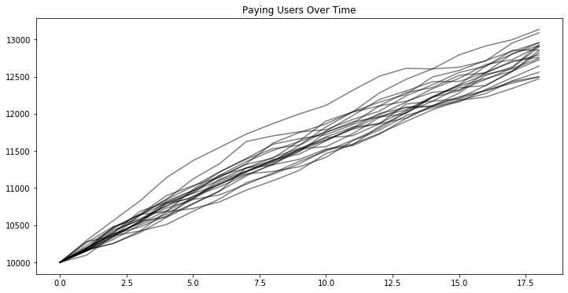
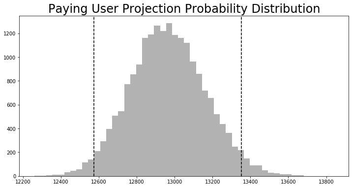

# Freemium Business Model Projections

Given historical data on new user acquisition, user churn, and user upgrade probalities, we can build a monte carlo simulation to project paying user numbers into the future. With that, we can project future values for paying users with a confidence interval.

In this model, there are two inputs and three transition probabilities. 
1. New Free Users: Each month, how many new free users join the platform?
2. New Premium Users: Each month, how many users join the platform directly using the paid service?
3. Upgrade Probability: What percentage of free users convert to paying users each month?
4. Free User Churn: What percentage of free users stop using the platform each month?
5. Paying User Churn: What percentage of paying users stop using the platform each month?

Note, there are many ways to increase model complexity to more closely match reality. For the purpose of this document, we will stick with only the model as outlined above.

### Prep Sample Data
Normally, we would use historical data to define acquisition rates and upgrade/churn probabilities. However, as an example, I will just generate artificial data using poisson distributions for the upgrade and churn data and normal distributions for the aquisition rates.


```python
import numpy as np
import random

n_months_historical_data = 36
rate_upgrade = 0.003
rate_churn_free_user = 0.02
rate_churn_paying_user = 0.02

def get_poisson_distribution(target_rate):
    base = 10000
    lambda_ = round(target_rate * base)
    raw_distribution = np.random.poisson(lambda_, base)
    as_rate = [x/float(base) for x in raw_distribution]
    
    return as_rate[0:n_months_historical_data]

upgrade = get_poisson_distribution(rate_upgrade)
churn_paying = get_poisson_distribution(rate_churn_paying_user)
churn_free = get_poisson_distribution(rate_churn_free_user)

new_free     = [round(x) for x in np.random.normal(2000,100, n_months)]
new_paying   = [round(x) for x in np.random.normal(100,5, n_months)]
```

Here is what the sample data looks like for churn rates and new free users. Remember, this is just sample data, with real historical data you would need to extrapolate the true population distribution as well.


```python
print('Paying User Churn Rates:')
print(churn_paying)
print()
print('Monthly New User Aquisition:')
print(new_free)
```

    Paying User Churn Rates:
    [0.0183, 0.0219, 0.0199, 0.0223, 0.0216, 0.0176, 0.0176, 0.0195, 0.0213, 0.0186, 0.0191, 0.0204, 0.0192, 0.0213, 0.0216, 0.022, 0.0181, 0.0208, 0.0192, 0.0211, 0.0174, 0.0186, 0.0184, 0.0226, 0.02, 0.0216, 0.0209, 0.0183, 0.0208, 0.0215, 0.0189, 0.0199, 0.0205, 0.0214, 0.021, 0.018]
    
    Monthly New User Aquisition:
    [2151.0, 2136.0, 2144.0, 1989.0, 2071.0, 2012.0, 2021.0, 1991.0, 2092.0, 1900.0, 1956.0, 1966.0, 2110.0, 2253.0, 2016.0, 2086.0, 2139.0, 1920.0]


### Monte Carlo Simulation
Given the historical (sample) user aquisition, churn, and upgrade data, we can now probabalistically model paying user numbers.


```python
n_trials = 20
n_months = 18

plt.figure(figsize=(12,6))

for trial in range(n_trials):
    ## Initial Conditions
    free_users   = 100000
    paying_users = 10000
    paying_user_path = [paying_users]
    
    ## Run simulation for one trial
    for month in range(n_months):
        free_to_paying = round(free_users * random.choice(upgrade))
        free_churn = round(free_users * random.choice(churn_free))
        free_users = free_users + random.choice(new_free) - free_to_paying - free_churn
        paying_churn = round(paying_users * random.choice(churn_paying))
        paying_users = paying_users + random.choice(new_paying) - paying_churn + free_to_paying
        paying_user_path.append(paying_users)
    plt.plot(paying_user_path, color = 'k', alpha = 0.5)
    
plt.title('Paying Users Over Time')
plt.show()
```





The above simulation only modelled 20 trials; the above chart serves to illustrate the path dependence of the total paying user numbers.

To understand better what our total paying numbers may look like 18 months in the future, let's model 20 thousand trials rather than 20, and, lets plot a histogram of the final number of paying users after 18 months.


```python
monte_carlo_results = []
n_trials = 20000
n_months = 18

for trial in range(n_trials):
    free_users   = 100000
    paying_users = 10000
    for month in range(n_months):
        free_to_paying = round(free_users * random.choice(conversion_free_to_paying))
        free_churn = round(free_users * random.choice(churn_free))
        free_users = free_users + random.choice(new_free) - free_to_paying - free_churn
        paying_churn = round(paying_users * random.choice(churn_paying))
        paying_users = paying_users + random.choice(new_paying) - paying_churn + free_to_paying
        
        row = {
            'trial_number': trial,
            'dt': month + 1,
            'free_users': free_users,
            'paying_users': paying_users,
        }
        monte_carlo_results.append(row)
```

We can use this final distribution to answer questions like, what is the most likely outcome for paying user number in 18 months? What is the probability that paying users will be greater than or less than some amount? Essentially, the monte carlo method allows you to assign error bars to your estimates for paying subscriber projections.


```python
terminal_paying_user_projections = [x['paying_users'] for x in monte_carlo_results if x['dt'] == 18]
mean_value = round(np.mean(terminal_paying_user_projections))
standard_deviation = np.std(terminal_paying_user_projections)
upper_bound = mean_value + 1.96 * standard_deviation
lower_bound = mean_value - 1.96 * standard_deviation

plt.figure(figsize=(12,6))
pd.DataFrame(monte_carlo_results)\
    .query('dt == 18')['paying_users']\
    .hist(bins = 50, color = 'k', alpha = 0.3)

plt.axvline(x=upper_bound, color = 'k', linestyle = '--')
plt.axvline(x=lower_bound, color = 'k', linestyle = '--')

plt.title('Paying User Projection Probability Distribution', fontsize=24)
plt.grid(False)
plt.show()

print(f'The projected paying user count for 18 months later is {int(mean_value)}.')
print(f'There is a 95% probability that the paying user count will fall within {int(round(1.96 * standard_deviation))} users of the projected value.')
```





    The projected paying user count for 18 months later is 12964.
    There is a 95% probability that the paying user count will fall within 389 users of the projected value.


### Additional Research

- How does the projected paying user probability distribution change if we assume a bull (bear) case where the user acquisition and churn rates are better (worse) than our observed historical data?
- Increase model complexity by specifying cohort-dependent churn/upgrade rates, seasonality, and churn-and-return user behavior.
